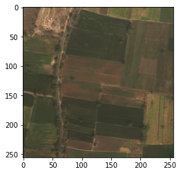
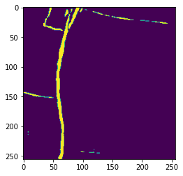

# RoadDetectionUNet
Built by Roshan Benefo, Leah Kreichman and Stefan Papazov

As part of a project for CIS 522, Deep Learning, my friends and I built a series of UNets to detect roads from satellite images. To run the file, install **requirements.txt**, and run main.py.

Some sample outputs of the networks are below:

Our presentation for this project is linked here: [link](https://docs.google.com/presentation/d/1RyRYoW74qZyarMaEDYOvpE7H6v_WS1GCiBf2xrGbhT8/edit?usp=sharing).

